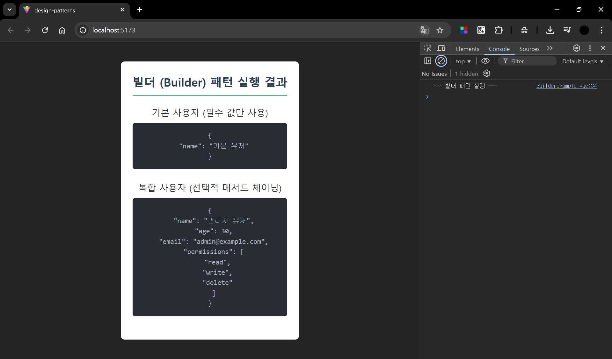
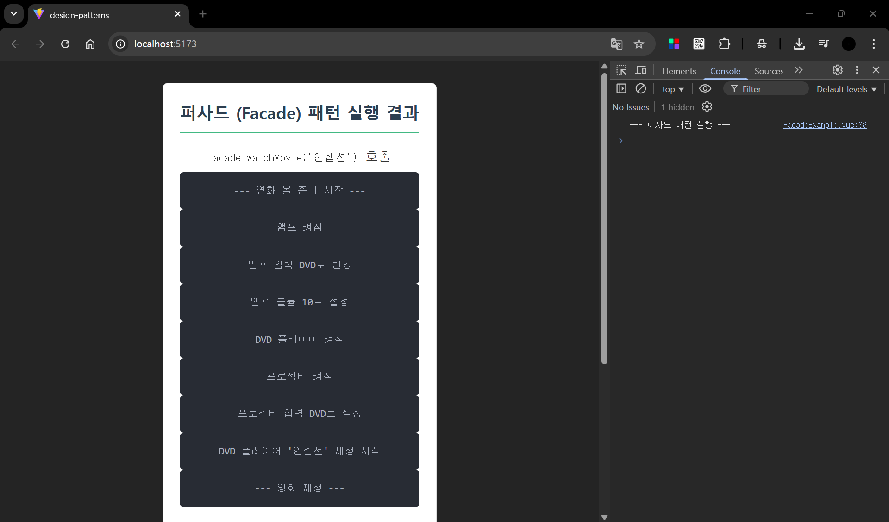
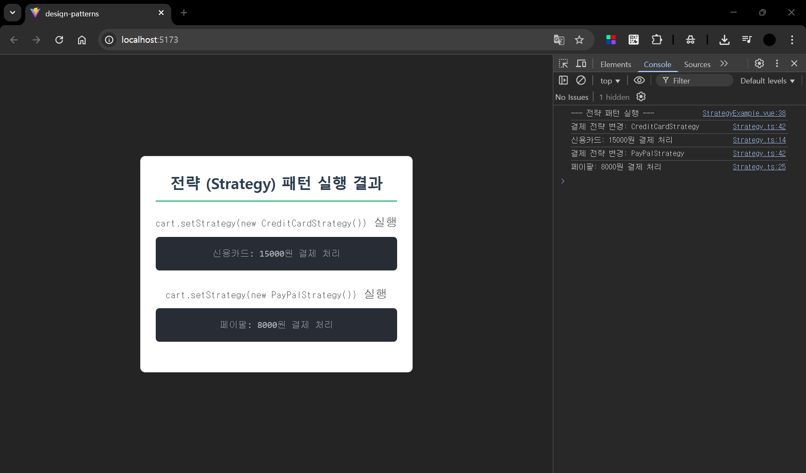

## 생성(Creational) 패턴

싱글톤 (Singleton Pattern) 패턴

팩토리 메서드 (Factory Method Pattern) 패턴

Builder (빌더) 패턴

## 구조(Structural) 패턴

어댑터 (Adapter) 패턴

데코레이터 (Decorator) 패턴

Facade (퍼사드) 패턴

## 행위(Behavioral) 패턴

옵저버 (Observer) 패턴

방문자 (Visitor) 패턴

Strategy (전략) 패턴

